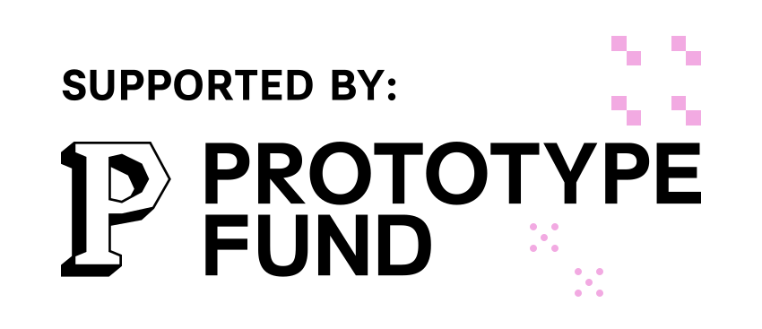

# CIVITAS Marketplace

Curated marketplace for reusable Civitas Core v2 use cases. Next.js 16 app,
authenticates against the platform's Keycloak and talks with the portal-backend
exclusively through the APISIX gateway (`/v1/*`).

## Prerequisites (local development)

1. CivitasCore dev environment running (`civitas-core-platform/dev-environment`,
   started via `start-portal-dev.sh`) - Keycloak :8080, APISIX :9080,
   portal-backend :8089.
2. **Keycloak client `marketplace`** must exist in the local realm `civitas-core`.
   Its definition is versioned here: [`docs/keycloak/marketplace-client.local.json`](docs/keycloak/marketplace-client.local.json).
   Add it to the `clients` array of `dev-environment/keycloak/realm-export.json`,
   or import it once via the admin console. Note: Keycloak imports the realm file
   **only when the realm does not exist yet** - after changing it, either reset the
   Keycloak volume or create the client manually (localhost:8080, switch the realm
   to `civitas-core` first, then Clients -> Import client).
   The secret in that file is a dev placeholder and matches `.env.example`; cluster
   deployments generate their own secret per environment.
3. **A user that actually has permissions.** Roles reach users only through groups,
   and the resulting assignments live in the portal-backend database - a user
   created in Keycloak alone can sign in but may see nothing. Simplest path: use an
   existing portal user. For a dedicated one, create it through the portal's user
   management (not directly in Keycloak) and give it Tenant Admin + Data Architect.
4. `.env.local` - see `.env.example`.

## Run

```bash
npm run dev # http://localhost:3001 (3000 is usually taken by portal-frontend default port)
```

## Architecture notes

```
browser ──▶ marketplace ──▶ APISIX :9080 ──▶ portal-backend :8089
           (session cookie)  (bearer token)   (scope-filtered data)
                                  │
                                  └──▶ OPA (computes X-Allowed-Scope-Ids)
```

* All backend calls go through APISIX (`localhost:9080/v1/...`) with the logged-in user's bearer token - never directly to portal-backend :8089. Collection endpoints reject requests without `X-Allowed-Scope-Ids`, and only APISIX may set it (the gateway strips any copy a client sends). Bypassing the gateway means either 403s or forged headers.
* Authorization (scopes) is computed by the platform's OPA; this app never sets `X-Allowed-Scope-Ids` itself.
* The signed-in user's own token is what travels - there is no service account. OPA therefore scopes every request to that user, and the backend attributes changes to them.
* The access token never reaches the browser: it stays in the encrypted session cookie and is unwrapped server-side in `lib/session.ts`.

## Project layout

| Path | Purpose |
|---|---|
| `auth.ts` / `auth.config.ts` | NextAuth setup: Keycloak provider, session-cookie callbacks, federated sign-out |
| `lib/session.ts` | `requireSession()` guard and `getAccessToken()` for server-side backend calls |
| `lib/tokenUtils.ts` | Access-token refresh against Keycloak |
| `lib/addon-catalog/` | Add-on rows from the repo-list: normalisation and installability (`listing.ts`), package fetching (`package-source.ts`), package facts for the detail page (`package-facts.ts`) |
| `lib/deployment-repo/` | Composing an add-on install as a deployment-repo change and opening it as a pull request |
| `app/(authenticated)/` | Route group for signed-in pages: shared shell plus sign-out |
| `app/login/` | Sign-in page, deliberately outside that group |

## Add-ons

Add-ons come from the **same repo-list** as use cases and data structures — one
catalogue, one fetch, one freshness state. Their rows carry the catalogue's
usual fields plus what an install needs: a pinned `ref` on the
`deploymentRef`, an `install` block (component name + subdomain) and a
`curation` verdict.

Listing and installability are separate questions. A row without those extra
fields is still listed, and its detail page names precisely what is missing —
which is the case for every v1-era entry today. Only a complete row offers
"Installation vorschlagen", which then

1. fetches the package from the add-on's own repository at the pinned ref
   (binary files stay binary - see `lib/package-file.ts`),
2. composes the change: the package under
   `deployment/addons/<componentName>/` plus one line in the environment's
   `components:` list,
3. opens a pull request against the deployment repository. Nothing merges -
   that stays with the operator.

The detail page additionally reads the add-on's own package at that ref to show
what it really brings: Keycloak roles, container images, Helm charts, parts
(`lib/addon-catalog/package-facts.ts`).

## Where auth checks belong

Every protected page calls `requireSession()` itself. The `(authenticated)` layout
also checks, but only so the shell is not rendered for signed-out visitors - it
cannot be the guard, because layouts are cached client-side and do not re-render
when navigating between pages that share them (see the Next.js authentication
guide, "Layouts and auth checks").

## Funding

This project is funded by the **Federal Ministry of Research, Technology and Space (BMFTR)** as part of the **[Prototype Fund](https://prototypefund.de/)**, an initiative by the Open Knowledge Foundation Germany. 

<div style="display: flex; gap: 20px; align-items: center; margin-top: 20px;">
  <a href="https://www.bmbf.de/" target="_blank">
    
  </a>
  <a href="https://prototypefund.de/" target="_blank">
    
  </a>
</div>
